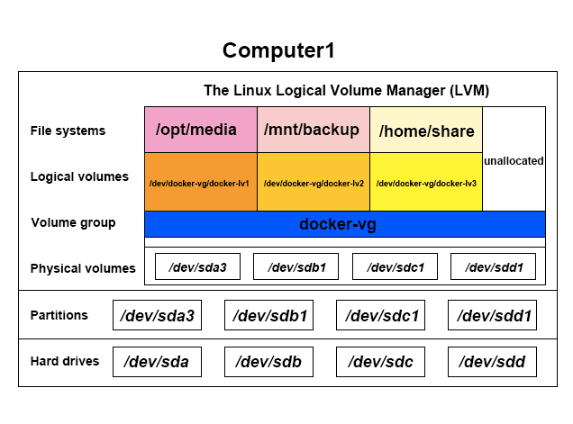

CentOs7安装openshift集群的LVM策略
===

主要内容
---
> 1. [物理驱动器](#物理驱动器)
> 2. [物理分区](#物理分区)
> 3. [物理卷](#物理卷)
> 4. [卷组](#卷组)
> 5. [逻辑卷](#逻辑卷)
> 6. [物理块](#物理块)
> 7. [逻辑块](#逻辑卷)
> 8. [线性映射](#线性映射)
> 9. [交错模式](#交错模式)
> 10. [CentOs7安装openshift的LVM](#CentOs7安装openshift的LVM)

通常一个磁盘分区的大小是固定的，随着时间的推移及应用的深入，会发现磁盘分区的空间会越来越小，甚至有时只有通过重新分区的方式来扩大分区的空间，而重新分区的代价往往就是需要重新安装操作系统。但是有了LVM技术，我们只需要将新的磁盘空间添加到空间不足的分区中即可。可以说LVM为我们管理磁盘带来了方便和灵活性。LVM（Logical Volume Manager），逻辑卷管理器，是Linux环境下对磁盘分区进行管理的一种灵活机智，LVM是建立在硬盘上和分区之上的一个逻辑层，来提高磁盘分区管理的灵活性。

概念篇
---

1. #### 物理驱动器
如：/dev/sda
显示物理驱动器：fdisk -l

2. #### 物理分区
如：/dev/sda1
创建物理分区：fdisk /dev/sda
注意分区类型必须为LVM(8e)

3. #### 物理卷
如：/dev/sda1
物理卷在物理分区下创建：pvcreate /dev/sda1
显示物理卷：pvs
物理卷详细信息：pvdisplay

4. #### 卷组
如：docker-vg
有了物理卷，才可以创建卷组：vgcreate docker-vg /dev/sda1
有了卷组，也可以把别的物理卷添加进卷组：vgextend docker-vg /dev/sda2
显示卷组：vgs
卷组详细信息：vgdisplay

5. #### 逻辑卷
如：docker-lv
也叫即逻辑分区，logical volume (LV)
逻辑卷相当于非LVM系统中的分区，它在卷组上建立，是一个标准的块设备，可以在其上建立文件系统
有了卷组，才可以创建逻辑卷：lvcreate docker-lv -L 100M docker-vg
显示逻辑卷：lvs
逻辑卷详细信息：lvdisplay
格式化mkfs.ext4 /dev/docker-vg/docker-lv

6. #### 物理块
physical extent (PE)
物理卷按大小相等的“块”为单位存储，块的大小与卷组中逻辑卷块的大小相同。

7. #### 逻辑块
logical extent (LE)
逻辑卷按“块”为单位存储，在一卷组中的所有逻辑卷的块大小是相同的。

8. #### 线性映射
线性映射-把一定范围的物理块按顺序分配给逻辑卷，如LV的LE 1-99映射到PV1，LE 100-347映射到PV2。

9. #### 交错模式
交错模式－将把逻辑块交错映射到不同的物理卷中，如 LV的LE 1映射为PV1的PE1，LE 2映射为PV2的PE1，LE 3映射为PV1的PE2.。这种方式可以提高逻辑卷的性能，但是采用这种方式建立的逻辑卷将不能在它们所在的物理卷中扩展。

实战篇
---
10. #### CentOs7安装openshift的LVM
